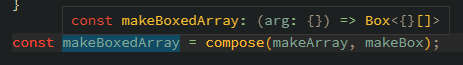
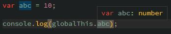

# [TypeScript] 3.4

{{ page.meta.description }}

## [Faster subsequent builds with the --incremental flag]

[Faster subsequent builds with the --incremental flag]: https://www.typescriptlang.org/docs/handbook/release-notes/typescript-3-4.html#faster-subsequent-builds-with-the---incremental-flag

{{label('should')}} {{label('easy')}}

`--incremental`オプションを使ってファイル単位でインクリメンタルビルドができるようになった。  
ビルド時に作成される`tsconfig.tsbuildinfo`を参照して、必要なビルドを判断する。

以下のファイル構成を含むプロジェクトを例にする。

```
  .
├──   main.ts
├──   sub.ts
└──   tsconfig.json
```

=== "main.ts"
    ```typescript
    import { summ } from "./sub";
    
    console.log(summ(39, 39));
    ```

=== "sub.ts"
    ```typescript
    export function summ(x: number, y: number) {
      return x + y + y;
    }
    ```

=== "tsconfig.json"
    ```json
    {
      "compilerOptions": {
        // incremental build
        "incremental": true,
        
        "target": "es5",
        "module": "commonjs",
        "sourceMap": true,
        "outDir": "out",
        
        "strict": true,
        "esModuleInterop": true,
        "skipLibCheck": true,
        "forceConsistentCasingInFileNames": true,
      }
    }
    ```

`npx tsc`を実行すると`tsconfig.tsbuildinfo`が生成される。

??? note "tsconfig.tsbuildinfo"
    ```json
    {
      "program": {
        "fileInfos": {
          "c:/users/syoum/work/sandbox/typescript/release-note/node_modules/typescript/lib/lib.d.ts": {
            "version": "49ff9798f592c8b7e628fd881401e68810c1b3589ecd7a41b32b3c287374cde0",
            "signature": "49ff9798f592c8b7e628fd881401e68810c1b3589ecd7a41b32b3c287374cde0"
          },
          "c:/users/syoum/work/sandbox/typescript/release-note/node_modules/typescript/lib/lib.es5.d.ts": {
            "version": "c8665e66018917580e71792b91022bcaf53fb946fab4aaf8dfb0738ed564db88",
            "signature": "c8665e66018917580e71792b91022bcaf53fb946fab4aaf8dfb0738ed564db88"
          },
          "c:/users/syoum/work/sandbox/typescript/release-note/node_modules/typescript/lib/lib.dom.d.ts": {
            "version": "6994c583b66862deca24d7bbf77297d95b9d3da8160dbd9beef6b847cf7c1376",
            "signature": "6994c583b66862deca24d7bbf77297d95b9d3da8160dbd9beef6b847cf7c1376"
          },
          "c:/users/syoum/work/sandbox/typescript/release-note/node_modules/typescript/lib/lib.webworker.importscripts.d.ts": {
            "version": "fe4e59403e34c7ff747abe4ff6abbc7718229556d7c1a5b93473fb53156c913b",
            "signature": "fe4e59403e34c7ff747abe4ff6abbc7718229556d7c1a5b93473fb53156c913b"
          },
          "c:/users/syoum/work/sandbox/typescript/release-note/node_modules/typescript/lib/lib.scripthost.d.ts": {
            "version": "b9faa17292f17d2ad75e34fac77dd63a6403af1dba02d39cd0cbb9ffdf3de8b9",
            "signature": "b9faa17292f17d2ad75e34fac77dd63a6403af1dba02d39cd0cbb9ffdf3de8b9"
          },
          "c:/users/syoum/work/sandbox/typescript/release-note/sub.ts": {
            "version": "a642b6e0940719b7786b24d58aeb960c519b61d650b8bef5cb36f621a0189796",
            "signature": "0e2338170381690650d253ab294fb37c7ce39d2716d2d78723676a4b09c93457"
          },
          "c:/users/syoum/work/sandbox/typescript/release-note/main.ts": {
            "version": "dd8f4dcd7b8017a8965f69473ea700aacb154c5423793b174b873a60a7f53004",
            "signature": "f761c91419d0a89422a0004ef1a92929dd4d2d5e5c16758654d8b0467d1998c6"
          }
        },
        "options": {
          "incremental": true,
          "target": 1,
          "module": 1,
          "sourceMap": true,
          "outDir": "C:/Users/syoum/work/sandbox/typescript/release-note/out",
          "strict": true,
          "esModuleInterop": true,
          "skipLibCheck": true,
          "forceConsistentCasingInFileNames": true,
          "configFilePath": "C:/Users/syoum/work/sandbox/typescript/release-note/tsconfig.json"
        },
        "referencedMap": {
          "c:/users/syoum/work/sandbox/typescript/release-note/main.ts": [
            "c:/users/syoum/work/sandbox/typescript/release-note/sub.ts"
          ]
        },
        "exportedModulesMap": {},
        "semanticDiagnosticsPerFile": [
          "c:/users/syoum/work/sandbox/typescript/release-note/node_modules/typescript/lib/lib.d.ts",
          "c:/users/syoum/work/sandbox/typescript/release-note/node_modules/typescript/lib/lib.es5.d.ts",
          "c:/users/syoum/work/sandbox/typescript/release-note/node_modules/typescript/lib/lib.dom.d.ts",
          "c:/users/syoum/work/sandbox/typescript/release-note/node_modules/typescript/lib/lib.webworker.importscripts.d.ts",
          "c:/users/syoum/work/sandbox/typescript/release-note/node_modules/typescript/lib/lib.scripthost.d.ts",
          "c:/users/syoum/work/sandbox/typescript/release-note/main.ts",
          "c:/users/syoum/work/sandbox/typescript/release-note/sub.ts"
        ]
      },
      "version": "3.4.5"
    }
    ```

ファイルに変更が加わっていると`version`が変わる。  
関数名や引数名などが変わると`signature`も変わるが、型変更だけでは変化がなかった。


## [Higher order type inference from generic functions]

[Higher order type inference from generic functions]: https://www.typescriptlang.org/docs/handbook/release-notes/typescript-3-4.html#higher-order-type-inference-from-generic-functions

{{label('had_better')}} {{label('easy')}}

ジェネリクス関数を引数にしてジェネリック関数を返す関数の戻り値(関数)に対して、型推論ができるようになった。

例として`A --(f)--> B` と `B --(g)--> C`の合成関数`A --(compose)--> C`を考える。

```typescript
function compose<A, B, C>(f: (arg: A) => B, g: (arg: B) => C): (arg: A) => C {
  return (x) => g(f(x));
}
```

以下のコードにおける`makeBoxedArray`は`T(arg: T) => Box<T[]>`と推論されるべき。

```typescript
interface Box<T> {
  value: T;
}

function makeArray<T>(x: T): T[] {
  return [x];
}

function makeBox<U>(value: U): Box<U> {
  return { value };
}

const makeBoxedArray = compose(makeArray, makeBox);
```

だが、TypeScript3.3以前ではそのように推論されない。  
TypeScript3.4からは推論される。

=== "v3.3まで"
    

=== "v3.4"
    


## [Improvements for ReadonlyArray and readonly tuples]

[Improvements for ReadonlyArray and readonly tuples]: https://www.typescriptlang.org/docs/handbook/release-notes/typescript-3-4.html#improvements-for-readonlyarray-and-readonly-tuples

{{label('had_better')}} {{label('easy')}}

readonlyのArrayを`readonly T[]`のように表現できるようになった。
また、readonlyのTupleを使えるようになった。

### readonlyなArray

| バージョン | 表現               |
| ---------- | ------------------ |
| v3.3以前   | `ReadonlyArray<T>` |
| v3.4       | `readonly T[]`     |

v3.3以前の表現はv3.4でも使える。

### readonlyなTuple

```typescript
const fruits: readonly [string, string] = ["apple", "orange"];
fruits[0] = "melon";  // 書き込みはできないのでエラー
```

### [Mapped Types]でArrayやTupleを指定したときのreadonly

v3.3以前の[Mapped Types]は、ArrayはTupleに対して`readonly`が有効にならない。

=== "v3.3以前"
    ```typescript
    type MyReadonly<T> = {
      readonly [K in keyof T]: T[K];
    };

    // number[] とみなされる..
    type B = MyReadonly<number[]>;

    // [string, boolean] とみなされる..
    type C = MyReadonly<[string, boolean]>;
    ```

=== "v3.4"
    ```typescript
    type MyReadonly<T> = {
      readonly [K in keyof T]: T[K];
    };

    // readonly number[] とみなされる
    type B = MyReadonly<number[]>;

    // readonly [string, boolean] とみなされる
    type C = MyReadonly<[string, boolean]>;
    ```


## [const assertions]

[const assertions]: https://www.typescriptlang.org/docs/handbook/release-notes/typescript-3-4.html#const-assertions

{{label('had_better')}} {{label('easy')}}

式に`as const`をつけると、値が以下の型である場合に変更不可になる。

* string
* number
* boolean
* array
* tuple
* object

```typescript
// const fixNumber = 10; と同じ
let fixNumber = 10 as const;

// const fixNums: readonly number[] = [10, 20, 30]; と同じ
const fixNums = [10, 20, 30] as const;

// const fixPair: readonly [number, string] = [100, "hundred"]; と同じ
const fixPair = [100, "hundred"] as const;

// 変更不可なObject
const fixObj = { id: 100, name: "hundred" } as const;

// fixObjNest.inner.id = 777 も不可
const fixObjNest = { inner: { id: 100 } } as const;
```

`<const>`を付けるでもOK。

```typescript
// const fixNums = [10, 20, 30] as const; と同じ
const fixNums = <const>[10, 20, 30];
```


## [Type-checking for globalThis]

[Type-checking for globalThis]: https://www.typescriptlang.org/docs/handbook/release-notes/typescript-3-4.html#type-checking-for-globalthis

{{label('not_necessary')}} {{label('easy')}}

`globalThis`で各環境のグローバルオブジェクトを認識できるようになった。
ブラウザだと`window`、Node.jsだと`global`に相当する。



!!! question "上記の出力は `undefined` になる"
    ちゃんと理由が分かっていない..。  
    `main.js`はグローバルファイルではないからということだろうか..🤔


[Mapped Types]: ../2.1/#mapped-types
