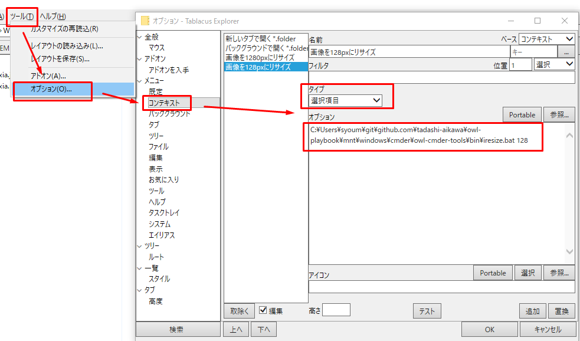

# [Tablacus Explorer] Top

{{link("https://tablacus.github.io/explorer.html")}}

アドオン
--------

|            アドオン名             |            コメント            |
| --------------------------------- | ------------------------------ |
| マウス                            |                                |
| キー                              |                                |
| ツリー                            |                                |
| メインメニュー                    |                                |
| 履歴                              | 表示数を50に減らした. 重いから |
| タブプラス                        | タブが格好良くなるから         |
| タブグループ                      | 作業ごとのお気に入りに近い     |
| マルチスレッド                    | コピペ中にロックされたくない   |
| フォルダの表示設定を覚える        |                                |
| 閉じたタブを元に戻す              | `Ctrl+Shift+T`                 |
| お気に入りバー (水平)             |                                |
| ラベル+ラベルボタン               |                                |
| 分割+3分割                        |                                |
| ツールチッププレビュー            | 画像プレビュー                 |
| スピードダイヤル                  |                                |
| 非アクティブペイン                |                                |
| Inner パンくずリスト アドレスバー | `Ctrl+L`                       |
| 次のペインに切り替える            | キーから`Alt+I`に割り当て      |
| X-Finder                          | 使える環境変数を増やす         |

サブメニューの作り方
--------------------

タイプを`メニュー`にして、オプションの`開く`と`閉じる`で囲めばいける。

{{link("http://tablacus.hatenablog.com/entry/2015/06/04/223939")}}

右クリックメニューの追加方法
----------------------------

### 選択アイテムを引数にとる簡易的なもの

`オプション`には実行ファイルと引数を指定する。  
そこで指定した引数のあとに、選択されたエントリが引数として1つ以上入ってくる。

### 複雑なもの

タイプは実行にして引数を設定する。

X-Finderアドオンをインストール済みなら以下の環境変数が使える。

https://www.eonet.ne.jp/~gakana/xf.html#env

X-Finderだけで使える環境変数や各項目の意味は以下のサイトが詳しい。

{{link("https://shirosai.web.fc2.com/tablacus/")}}

